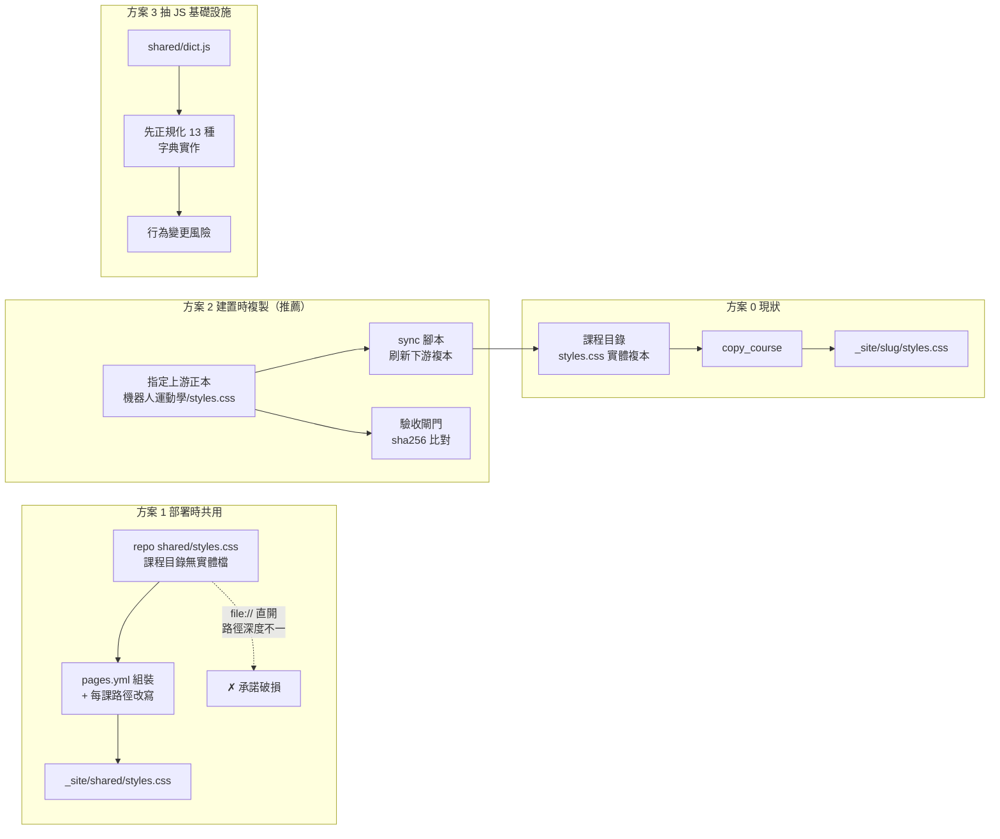

# 共用資產抽取評估（SHARED-ASSETS-EVAL）

← [工作流入口](README.md)｜[品質關卡](QUALITY-GATES.md)｜[Pages 部署契約](GITHUB-PAGES.md)｜[codex 建課產線](BUILD-WITH-CODEX.md)

**性質**：唯讀評估報告，決策輸入用。本次評估未修改任何產品檔。
**日期**：2026-08-27
**問題**：repo 已有 22 門互動課程網站，是否值得把 `styles.css` / `app.js` / HTML 骨架抽出成共用資產？
**樣本**：已完成課程（21 份 `styles.css`、22 份課程 JS）。建置中的 `共通基礎/物理/互動課程/` 與 `電機/02-電機核心/電路學-互動課程/` 內容仍在變動，不納入樣本。

---

## 0. 結論先講

**推薦方案 2（建置時複製，現狀強化）**，且只對 `styles.css` 施作；**不推薦抽取 JS（方案 3）**，**明確不推薦方案 1（部署時共用）**。

一句話理由：盤點顯示這個 repo 目前**沒有真正的共用資產可抽**——21 份 `styles.css` 有 17 種不同 sha256、分屬 3 個模板家族，JS 端可抽取的基礎設施只佔全部 app.js 位元組的約 2%，而三個月來只發生過 **1 次**跨課樣式修改。抽取的成本是「先把 17 種變體正規化成 1 種」，那是一場改版工程，不是去重工程；而它要解決的痛，歷史證據顯示一年不到一次。

---

## 1. 盤點數據

### 1.1 styles.css 家族：17 種變體、只有 1 組真正重複

| 群 | sha256 前 8 | 位元組 | 成員數 | 成員 |
|----|-----------|-------|-------|------|
| **G1** | `894f24a1` | 4141 | **5** | 數學先修、Linux、作業系統、機器人數學基礎、機器人運動學 |
| G11 | `4fb90987` | 3982 | 1 | 機器人學習 |
| G12 | `bb500eca` | 3969 | 1 | 機器人視覺 |
| G13 | `d826207e` | 3985 | 1 | 機器人路徑規劃 |
| G16 | `2d85fe76` | 4194 | 1 | 計算機組織 |
| G17 | `3a6814c1` | 3422 | 1 | 逆向工程 |
| G14 | `4ee7f8c2` | 4328 | 1 | 網路協定 |
| G15 | `aff5cd4f` | 6890 | 1 | 網路安全 |
| G10 | `378c6d27` | 4227 | 1 | 互動學習網站（主站） |
| G2 | `36dde844` | 31066 | 1 | IoT 主課 |
| G3–G9 | 各異 | 7587–23823 | 各 1 | IoT 知識群 01–07 |
| G18 | `20ac43ed` | 17845 | 1 | 電力系統 |

**21 個檔案 → 17 個不同 sha256**。唯一位元組相同的一組是 G1（5 門課），其餘全部各自為政。

**模板家族**（依變數命名與結構歸類，跨家族不是換色而是換骨架）：

| 家族 | 特徵 | 成員 | 深色模式 |
|------|------|------|---------|
| A：課綱課家族 | 單行 minified、`--ink/--paper/--accent2` | G1 五門 + 機器人學習/視覺/路徑規劃 + 計算機組織 | 無 |
| B：深色模式家族 | `color-scheme:light dark`、`--bg/--soft/--code` | 逆向工程、網路協定 | **有** |
| C：IoT 知識群家族 | 多行格式化、語意化 token（`--cyan`/`--green-soft`） | IoT 主課、知識群 01–07、電力系統 | 無 |

跨家族 diff：G1 vs 網路協定＝ 64 行；IoT 01 vs 02 ＝ 231 行（連變數集合本身都不同，01 有 `--surface-3`/`--cyan`，02 換成 `--green-soft`/`--blue-soft`）。同家族 diff 僅 4 行（純換色）。

`:root` 變數數量從 **8 到 21** 不等——沒有共同的設計 token 詞彙表。**21 份中只有 2 份支援 `prefers-color-scheme`**。

### 1.2 上游正本：慣例已經自然收斂

G1 家族的血緣可從 git 追出來：

| 首次出現 | commit | 課程 |
|---------|--------|------|
| 2026-08-14 | `2f3787a` | 機器人運動學 ← **de-facto 上游正本** |
| 2026-08-25 | `2b5ee2c` | 機器人數學基礎 |
| 2026-08-26 | `600a6e9` | 作業系統 |
| 2026-08-26 | `b2fca6a` | Linux |
| 2026-08-27 | `58ced4f` | 數學先修 |

13 天內新增的 4 門課全部 cp 自同一份，加上建置中的物理與電路學共 7 份位元組相同。BUILD-WITH-CODEX 的「`styles.css` 直接 `cp` 既有課的（位元組相同可驗）」慣例**正在生效且自我強化**。這是評估最重要的一個事實：問題不是「沒有共用」，而是「共用靠口頭慣例，沒有指定正本、沒有驗收閘門」。

### 1.3 app.js：可抽取的基礎設施約佔 2%

22 份課程 JS，單檔 5.1 KB – 53.3 KB，合計約 450 KB。行數不可比（部分課被壓成單行）。

**DOM 別名命名根本不統一**——至少 5 套並存：

| 慣例 | 課程 |
|------|------|
| `$` / `$$` | IoT 主課、網路安全 |
| `$` / `q` | Linux、作業系統、數學先修、機器人 4 門 |
| `q` / `qa` | IoT 知識群 06 全部 8 檔、07 |
| `id` / `on` | 計算機組織、逆向工程、IoT 知識群 01–03 |
| `byId` / `el` / `q` | 網路協定 |
| 無別名 | IoT 04/05、電力系統、攻擊手法細講 |

五檔取樣（計算機組織、Linux、機器人運動學、網路安全、數學先修）的行數歸類：基礎設施佔 **4.8%–20.0%**，其中數學先修的 15.5% 有 76% 來自它獨有的 quiz 框架。

三個宣稱的「共用基礎設施」實測結果：

| 候選 | 普及度 | 每課體積 | 佔全檔 | 判定 |
|------|-------|---------|-------|------|
| 字典搜尋（`term-search`/`term-count`/`.term-card`） | **13 門課** | 389–1054 B | 3.6%–13.6% | **真的是複製貼上**，但 haystack 有分歧 |
| 自我檢核框架（`quiz-reset`/`Q` 題庫） | 已完成課程 **1 門**（數學先修）；建置中的物理、電路學各 1 份，且與數學先修**逐字相同** | 約 93 行 | 約 12% | **正在長出來的重複**，見 §4.3 |
| 守衛樣板（`if(!x)return`） | 全部，每個 widget 函式各一份（10–16 次/檔） | 數十 B | <1% | 從未被抽成 `function guard()`；是慣例不是模組 |
| DOM 別名／`on()`／`clamp`/`rad`/`deg` | `on()` 4/5 檔實作一致；`clamp`/`rad`/`deg` 2 檔逐字相同 | 50–400 B | <2% | 5 套命名並存，抽取＝先改名 |

**字典搜尋的相同度是分級的**（這點修正了「只是結構相似」的直覺）：

| 課程 | 別名 | 搜尋範圍（haystack） | 與計算機組織版的關係 |
|------|------|-------------------|-------------------|
| 計算機組織 | `id` | `textContent` **only** | 基準 |
| 機器人運動學 | `$` | `textContent` only | **逐字相同**（僅引號風格差異） |
| Linux | `$` | `textContent + data-search` | 高度相似（多 `data-search` 與 `term-count` 防呆） |
| 網路協定 | `byId` | `data-search` **only** | 高度相似但 haystack 相反 |
| 數學先修 | `$` | `textContent + data-search` | 改寫成 `for` 迴圈、加 `q===""` 判斷 |
| 網路安全 | `$$` | 獨立實作、另有無結果提示元素 | **僅概念相同**，獨立重寫 |

所以：程式碼確實是複製貼上的，但**已經漂移出三種不同的搜尋語意**。共用的硬契約是 DOM id（`term-search`、`term-count`、`.term-card`、`data-search`，輸出字串 `顯示 N 個條目`）。要抽成一個共用檔，必須先決定 haystack 該是哪一種——三選一都會**改變某些既有課的搜尋行為**（計算機組織與機器人運動學會突然開始搜 `data-search`；網路協定會突然開始搜正文）。這是行為變更，需要 13 門課重跑字典驗收。

**可抽取上限估算**：13 課 × 約 700 B ≈ **9 KB**，佔 450 KB 的 **2%**。

另一個 extraction 陷阱：`$` 這個名字在 Linux／機器人運動學／數學先修是 `getElementById` 別名，在網路安全卻是 `querySelector` 別名——**同名不同義**。任何共用檔都必須自帶命名空間，不能假設宿主的別名語意。

### 1.4 HTML 骨架：規格複用 ≠ 檔案複用

| 骨架元素 | 跨課一致性 |
|---------|-----------|
| `main-site-link` | **100% 逐位元組相同**（114 字元，`7a00cc4` 一次性統一注入） |
| `eyebrow` | 結構相同，僅文字不同 |
| `pager` | class 名一致，但標籤 `<div>` / `<nav>` 各半，網路安全另加空 `<span>` 佔位 |
| `topbar` | **不一致**：`topbar` vs `top-nav`（+`top-nav-inner` + 獨立 `site-header`），`aria-label` 有無不定 |
| `prereq` | **5 門中 3 門沒有**，改用 `<p class="note">` 承擔同角色 |
| `workspace` | **5 門中只有 2 門有**，且兩者內部 schema 完全不同 |
| `<head>` | charset/viewport/stylesheet 三標籤相同；`<script>` 有的在 head（`defer`）有的在 body 尾 |

index.html 中骨架佔 **13%–32%**。

**這是本題最關鍵的概念區分**：骨架的一致性由 `BUILD-SPEC.md` 的 DOM 契約控制，而不是由共用檔控制。契約複用的好處（codex 照抄即零缺陷）已經拿到；把它變成共用**檔案**（partial / include / 模板引擎）需要引入建置步驟，直接違反 QUALITY-GATES §4 的「HTML、CSS、JavaScript 與所有必要資產都在主題目錄內」與「開發與測試不新增套件鎖檔」。純靜態 HTML 沒有無建置的 include 機制。**HTML 骨架不列入可抽取範圍。**

### 1.5 維運成本現況：三個月只痛過一次

| 指標 | 現況 |
|------|------|
| `pages.yml` 行數 | 263 |
| `copy_course` | 定義 1 次、呼叫 15 次；另有 7 門課走手寫 `mkdir -p` + `cp`（第 97–167 行）兩套並存 |
| 新增一課要改 | **3 處**（`on.push.paths` 3 行、`copy_course` 1 行、必要時 Python `replacements` 加 slug 規則）＋主站入口＋來源 README |
| 全站改樣式要動的檔 | 21 份 `styles.css`（其中 5 份同源，實際 17 種變體要各自處理） |
| 資產總量 | styles.css 205 KB／課程 JS 553 KB／index.html 389 KB |

**歷史證據（58 commits，2026-05-27 → 2026-08-27）**：

- `styles.css` 被改過的 commit 共 15 個，**其中 14 個是「新增課程」**，只有 **1 個是真正的跨課樣式變更**：
  `7a00cc4 feat: add central navigation to published sites` —— 15 份 `styles.css` 各自附加**完全相同的 14 行** `.main-site-link` 區塊，全 commit 128 檔。這是方案 0 痛點的唯一實測樣本，而它一個 commit 就做完了。
- 唯一跨課同時改 `app.js` 的修復 `22d705d fix: 修正互動課程計算與按鈕狀態` 動了 3 門課，但拆開看是 **4 個彼此無關的課程專屬 bug**（上拉狀態未保存、旋轉矩陣左右乘顛倒、`innerHTML` 改 `replaceChildren`、連結器輸出）。**不是同一個共用基礎設施 bug 被複製 N 份。**

### 1.6 既有的共用先例（重要）

`專題/網路安全/攻擊手法細講/` 沒有自己的 `styles.css`，14 個 HTML 全部寫 `<link rel="stylesheet" href="../互動課程/styles.css">`；部署時由 `pages.yml` 的 `replacements` 把 `../互動課程/` 改寫成 `../network-security/`。

這是全 repo **唯一**的跨課共用 CSS，而且它在 `file://` 直開與 Pages 上都可用。它證明「兄弟目錄借用」可行——但也只在**同一個上層目錄底下**可行（見 §3 方案 1 的深度問題）。

---

## 2. 必須尊重的既有設計決策

| 來源 | 約束 | 對本案的意義 |
|------|------|-------------|
| QUALITY-GATES §4 | 「HTML、CSS、JavaScript 與所有必要資產都在主題目錄內」「不含外部字型、圖片、分析碼、CDN、遠端 API 或第三方執行期依賴」 | 任何把資產搬出課程目錄的方案都要正面回答這條 |
| QUALITY-GATES §4 | 「開發與測試不新增套件鎖檔」 | 排除模板引擎／打包器 |
| README 非侵入式邊界 | 「每個網站的程式、規格與驗收紀錄放回知識來源所屬目錄」 | repo 根目錄新增 `shared/` 與此精神有張力 |
| GITHUB-PAGES | 「原始碼仍留在各知識來源的目錄；Actions 只在 runner 上組合 `_site/`」 | 部署層可以做組裝，但不得回寫 repo |
| BUILD-WITH-CODEX | 「`styles.css` 直接 `cp` 既有課的（位元組相同可驗）」；CRLF 正規化的**例外**就是這類檔 | 「位元組相同」已是既有驗收語彙，方案應沿用而非廢除 |
| 課程 README | 網路協定：「直接以瀏覽器開啟 index.html 即可。所有資產都在本目錄，無需建置或網路連線」；逆向工程同義 | `file://` 直開是**對讀者的書面承諾**，不只是開發便利 |

---

## 3. 方案比較



### 比較矩陣

| 考量軸 | 方案 0 現狀 | **方案 1 部署時共用** | **方案 2 建置時複製（強化）** | **方案 3 抽 JS 基礎設施** | 方案 4 pages.yml 表驅動 |
|--------|-----------|---------------------|---------------------------|------------------------|----------------------|
| 離線自足鐵律 | ✅ 完全符合 | ⚠️ 線上仍離線，但 repo 內課程目錄不再自足，QUALITY-GATES §4 字面違反 | ✅ 完全符合 | ⚠️ 若共用檔放課程目錄外則同方案 1 | ✅ 不影響 |
| `file://` 直開 | ✅ 可用 | ❌ **破損**。課程目錄深度不一（`專題/X/互動課程/` vs `專題/IoT.../知識群互動網站/01-.../`），`../shared/` 的相對層數每課不同，本地與部署路徑無法同時成立 | ✅ 可用 | ⚠️ 同上，除非共用檔仍複製進每課目錄（那就退化成方案 2） | ✅ 不影響 |
| Pages 部署複雜度 | 中（263 行、兩套 cp 並存） | ❌ **更高**：需 cp shared 進 `_site`，且 `replacements` 要為約 25 門課各加一條 stylesheet 路徑改寫規則 | ➖ 不變 | ❌ 同方案 1 | ✅ **降低**：3 處 → 1 行 |
| 22 門課回溯遷移 | ➖ 無 | ❌ 高：須先把 17 種變體正規化成 1 種，逐課視覺回歸（21 課 × 桌機/手機） | ✅ 低：可只對 A 家族施作，B/C 家族維持現狀 | ❌ 高：13 課字典行為需重新驗收 | ✅ 低：純 CI 改動 |
| 只適用新課？ | — | 否（要全遷才有意義） | **是，可增量**：新課直接吃正本，舊課要不要對齊各自決定 | 否（半套等於沒抽） | 可增量 |
| 「位元組相同」驗收慣例 | ✅ 已在用 | ❌ **廢除**（沒有複本可比） | ✅ **升級成閘門**：從口頭慣例變成腳本檢查 | ⚠️ JS 端本來就沒有這慣例 | ✅ 不影響 |
| 單點故障 | ✅ 一課壞只壞一課 | ❌ **共用檔壞 → 22 門課同時壞**，且 Pages 無 staging | ✅ 一課壞只壞一課；正本壞了也要 sync 才擴散，有一次人工閘門 | ❌ 13 門課同時壞 | ⚠️ 中：yml 壞則全站不部署（現狀已然） |
| 與 codex 產線相容 | ✅ codex 只建 HTML，不碰 css/js | ⚠️ 共用資產的所有權未定義（BUILD-WITH-CODEX 第 4 層明文「不碰 app.js／styles.css」，但沒說誰維護共用檔） | ✅ **最相容**：指揮官照舊 `cp`，只是來源明確化 | ⚠️ app.js 由指揮官親手寫，共用檔會多一個跨課擁有者 | ✅ 不影響 |
| 解決的實際痛 | — | 全站樣式改動 1 檔搞定 | 全站樣式改動 1 檔 + 1 次 sync | 省約 9 KB / 2% JS | 新增課程少改 2 處 |
| 痛的實測頻率 | — | **3 個月 1 次** | 同左 | **0 次**跨課 JS 基礎設施 bug；但自我檢核框架的逐字複本正在增加，見 §4.3 觀察哨 | 3 個月 6 次（每加一課） |

### 方案 1 的深度問題（值得單獨講）

`_site/` 是扁平的：每門課都是 `_site/<slug>/`，所以部署後引用共用檔一律是 `../shared/styles.css`。但 repo 內課程目錄深度不一：

- `專題/網路協定/互動課程/` → 需 `../../../shared/styles.css`
- `專題/IoT聯網裝置/知識群互動網站/01-板級電源與PCB/` → 需 `../../../../shared/styles.css`
- `共通基礎/數學/互動課程/` → 需 `../../../shared/styles.css`

要讓 `file://` 與 Pages 同時可用，就得**每門課在 `replacements` 加一條 stylesheet 改寫規則**——pages.yml 從 263 行往上長，而不是變短。方案 1 用「多一份部署複雜度」換「少 20 份 4 KB 檔案」，方向是反的。

（`攻擊手法細講` 之所以成立，正是因為它與 `互動課程/` 是同層兄弟，`../互動課程/` 這一層在本地與部署後都剛好對得上。這個技巧只在同一個上層目錄內可複製，無法推廣到全 repo。）

---

## 4. 推薦

### 4.1 採納：方案 2（建置時複製，現狀強化），範圍限 `styles.css`

把已經在跑的 `cp` 慣例從「口頭」升級成「有正本、有腳本、有閘門」，其餘一律不動。

具體內容：

1. **指定上游正本**：`專題/機器人運動學/互動課程/styles.css`（A 家族血緣起點，5 門課已與它位元組相同）。在 BUILD-WITH-CODEX 把「cp 既有課的」改寫成「cp 正本」，路徑寫死。
2. **明確登記家族歸屬**：A 家族（課綱課，適用正本）／B 家族（深色模式：逆向工程、網路協定）／C 家族（IoT 知識群 + 電力系統，各自客製）。**只有 A 家族受正本管轄**；B、C 家族凍結在現狀，不強制對齊。
3. **一個 sync 腳本**：`wf/workflows/interactive-study-site/sync-styles.*`，把正本刷到 A 家族所有課程目錄，並支援 `--check` 模式（只比對 sha256、不寫入）供驗收與 CI 使用。腳本必須以位元組模式複製，**不得做 CRLF 正規化**（BUILD-WITH-CODEX 已載明此例外）。
4. **驗收閘門**：獨立驗收員的固定項加一條「`sync-styles --check` 通過」，取代目前靠人記得比對的做法。
5. **改樣式的新流程**：改正本 → 跑 sync → 一個 commit 掃過 A 家族 → 抽 2 門課做桌機/手機視覺回歸。等同重演 `7a00cc4`，但少掉人工複製貼上 15 次的環節。

**為什麼是這個方案**：它是唯一同時滿足「離線自足鐵律」「`file://` 直開承諾」「零部署複雜度增加」「保住位元組相同驗收語彙」「與 codex 產線既有分工零衝突」的選項，而且**可以只做 A 家族**——遷移成本接近零，因為那 5 門課已經位元組相同了，腳本第一次跑就是 no-op。

### 4.2 不採納：方案 1

三個獨立的否決理由，任一條就足夠：
- 破壞 `網路協定` 與 `逆向工程` README 對讀者的書面承諾（「所有資產都在本目錄」）。
- 讓 pages.yml 變長而非變短（每課一條路徑改寫規則）。
- 單點故障：共用檔一壞，22 門課同時壞，而 Pages 沒有 staging 環境可攔。

換來的好處（全站樣式改動從「改 1 檔 + sync」變成「改 1 檔」）在方案 2 面前只剩一個腳本呼叫的差距。

### 4.3 不採納（暫時）：方案 3——但這是最該設觀察哨的一項

- 可抽取上限實測約 **9 KB / 2%**。投入產出比在體積上完全不成立。
- 「守衛樣板」是每個 widget 函式開頭的 inline 一行，從未被抽成函式，也不該被抽（抽了反而多一次呼叫、少一層可讀性）。
- 「字典搜尋」13 門課確實是複製貼上，但已漂移出三種 haystack 語意（§1.3）。統一它是行為變更，要 13 門課重跑字典驗收，換 9 KB。不划算。
- `$` 同名不同義（`getElementById` vs `querySelector`）意味著共用檔不能沿用宿主別名，必須自帶命名空間——抽取的實作成本比帳面高。
- 三個月零次「同一個共用基礎設施 bug 被複製 N 份」的紀錄。跨課 app.js 修復只有 `22d705d` 一次，拆開是 4 個彼此無關的課程專屬 bug。

**但要盯著「自我檢核框架」**。它是本次盤點唯一**正在擴散**的逐字複製樣板：數學先修（已完成）、物理與電路學（建置中）三份的 `check()`／`progress()`／`quiz-reset` 邏輯與全部 UI 提示字串**一字不差**，只換 `Q` 題庫資料，每份約 93 行。它是幾天內才出現的新樣板，尚未達到值得抽取的規模，但成長方向明確——而且它比字典搜尋更適合抽取：題庫（資料）與框架（邏輯）的邊界天然乾淨，抽取時不需要在多個既有語意間二選一。

> 註：物理與電路學的觀測來自建置中的產線，內容仍可能變動，此處僅作趨勢判讀，不作為結論依據。

**重新評估的觸發條件**（寫下來，將來有據可循）——滿足任一條就回頭做方案 3，且優先抽自我檢核框架而非字典搜尋：

1. 自我檢核框架的逐字複本達到 **5 門以上已完成課程**；或
2. 出現任何一次「同一個 JS 基礎設施缺陷必須在 3 門以上課程重複修同樣的補丁」。

在那之前，這是在解決還沒發生的問題。

### 4.4 建議另案處理：方案 4（pages.yml 表驅動）

與共用資產無關，但盤點中浮現、ROI 明顯更高的維運改善：

- 目前兩套複製邏輯並存（7 門課手寫 `cp`、15 門課走 `copy_course`），先把前 7 門收斂進 `copy_course`。
- 新增一課仍需改 3 處，其中 `on.push.paths` 那 3 行可用 `專題/**/*.html` 之類的萬用路徑取代（取捨：觸發面變寬，非課程檔變更也會觸發部署；本 repo 部署便宜、有 concurrency cancellation，可接受）。
- 這樣新增一課只剩 1 行 `copy_course` + 必要的 `replacements`。實測頻率：三個月 6 次，比樣式改動的 1 次高 6 倍。

**這是獨立決策，不必與本案綁定。**

### 4.5 順帶記錄的兩件事（非本案範圍）

- `共通基礎/物理/互動課程/` 與 `電機/02-電機核心/電路學-互動課程/` 尚未接進 `pages.yml`。兩條產線仍在建置中，屬預期狀態；完工收尾時記得走 GITHUB-PAGES 的三步接線。
- 檔名慣例不統一：多數課叫 `app.js`，IoT 知識群 07 叫 `course.js` 並多一份 `glossary.css`。若將來做任何腳本化處理，需先確認命名或讓腳本容忍。

---

## 5. 若採納方案 2 的遷移步驟

| # | 步驟 | 動到的檔 | 風險 |
|---|------|---------|------|
| 1 | 確認 A 家族名單與正本，跑一次 sha256 全比對 | 無（唯讀） | 無 |
| 2 | 寫 `sync-styles`（支援 `--check`，位元組模式複製，不做 CRLF 轉換） | 新增 1 個腳本 | 低 |
| 3 | 對 A 家族 5 門位元組相同的課跑一次 sync，確認結果為 no-op | 無變更 | 無（若非 no-op 表示名單判斷有誤，停下重查） |
| 4 | 決定機器人學習/視覺/路徑規劃/計算機組織 4 門「同家族但已換色」的課要不要併入正本 | 4 份 styles.css | **中**：會改變這 4 門課的既有配色，需視覺回歸與使用者確認。**建議先不併**，維持現狀即可 |
| 5 | BUILD-WITH-CODEX 第 2 步的 `styles.css` 那句改成指向正本路徑 | 1 份 md | 低 |
| 6 | QUALITY-GATES 驗收固定項加一條 `sync-styles --check` | 1 份 md | 低 |
| 7 | 在本檔記錄家族歸屬表，供將來新課判斷該 cp 哪一份 | 本檔 | 無 |

步驟 1–3、5–7 的實質風險接近零（第一次 sync 是 no-op）。**步驟 4 是唯一有視覺影響的動作，建議單獨決策、可以不做。**

## 6. 風險與反對意見

| 風險 | 說明 | 緩解 |
|------|------|------|
| 正本漂移 | 有人直接改下游課程的 styles.css，sync 時被覆蓋 | `--check` 進驗收固定項，漂移在合併前就被抓到；且下游課程樣式改動本來就該回到正本 |
| 家族分裂加劇 | B、C 家族不受管轄，將來可能長成第 4、第 5 家族 | 本檔的家族表就是登記處；新課一律從 A 家族正本出發，除非有明確理由 |
| 深色模式若要全站化 | 目前只有 2/21 支援，且屬 B 家族。要全站深色模式，等於把 A 家族併進 B 家族 | 那是一次真正的設計改版，屆時方案 2 的 sync 腳本正好是執行工具；不需要為此預先抽共用檔 |
| 「這只是把問題延後」 | 合理的反對。方案 2 不消除重複，只讓重複可控 | 接受。以三個月 1 次的變更頻率，可控的重複比不可回退的抽取划算；§4.3 已寫下重新評估的觸發條件 |
| 評估樣本不完整 | 建置中的物理、電路學未納入 | 兩者的 styles.css 與 A 家族正本位元組相同（外部比對確認），不影響結論 |

## 7. 這份報告不建議做的事

- 不建議引入任何模板引擎、打包器或 HTML include 機制（違反 §4 不新增套件鎖檔，且 HTML 骨架的一致性本來就由 BUILD-SPEC 契約保障）。
- 不建議為了「共用」而統一 B、C 家族的視覺——那是設計決策，不是架構決策，且會動到 12 門已驗收課程的外觀。
- 不建議在 repo 根目錄新增 `shared/`——與 README 非侵入式邊界「每個網站的程式放回知識來源所屬目錄」有張力，且方案 2 不需要它。


---

## 8. 已採納與實作紀錄

**裁決**：使用者於 2026-08-27 採納 **方案 2**（styles.css 正本＋同步閘門）與 **方案 4**（pages.yml 表驅動）。方案 1、方案 3 不採納，理由見 §4.2、§4.3；方案 3 的重評觸發條件維持有效。

### 8.1 方案 2 實作

| 項目 | 內容 |
|------|------|
| 新增 | `wf/workflows/interactive-study-site/tools/sync-styles.py`（160 行，stdlib only） |
| 正本 | `專題/機器人運動學/互動課程/styles.css`（sha256 `80eb33ac…`，4163 B） |
| 管轄範圍 | A 家族 5 門課（正本自身＋4 門下游）。B、C 家族與主站刻意不納管，腳本內以註解記錄，避免將來誤加 |
| 介面 | `--check` 只比對（漂移或缺檔 → exit 1）；`--sync` 以**二進位模式**覆寫（不做 CRLF 正規化，遵守 BUILD-WITH-CODEX 的例外條款） |
| 登記新課 | 在腳本頂部 `FAMILY` 清單加一行相對路徑，腳本 docstring 已寫明流程 |

建置中的 `共通基礎/物理/互動課程/` 與 `電機/02-電機核心/電路學-互動課程/` **未納入清單**，在 `FAMILY` 下方以註解列為待登記，交付後由 Lead 加入。

**no-op 證明**（現狀直接通過，遷移成本為零）：

```text
$ python wf/workflows/interactive-study-site/tools/sync-styles.py --check
正本　　：專題/機器人運動學/互動課程/styles.css
sha256　：80eb33ac3c13e07358b9c7fbc383f040a159a6cb85791c0f74b98cb8ce1eda90
位元組數：4141
[相同] 專題/機器人數學基礎/互動課程
[相同] 專題/作業系統/互動課程
[相同] 專題/Linux/互動課程
[相同] 共通基礎/數學/互動課程
共 4 門下游課程：4 門相同，0 門漂移，0 門缺檔
[通過] 全家族與正本位元組相同。   → exit 0
```

**閘門非空轉驗證**（避免驗收項變成擺設）：對 `專題/Linux/互動課程/styles.css` 注入 15 位元組改動 → `--check` 如期 exit 1 並指出漂移雜湊；`--sync` 修復後 `--check` 回到 exit 0，且 `git status` 對產品目錄為乾淨——證明 `--sync` 還原的是**位元組相同**的內容，而非近似內容。

### 8.2 方案 4 實作

`pages.yml` 由 **263 行縮到 191 行**，`on.push.paths` 由 **68 條縮到 25 條**。

| 變更 | 說明 |
|------|------|
| 統一複製邏輯 | 原本 7 門課走手寫 `mkdir -p` + 逐檔 `cp`、15 門課走 `copy_course`，兩套並存。已全部收斂到單一 `copy_course`＋課程表。前提已實測確認：那 7 門課的目錄第一層恰好只有 `index.html`／`app.js`／`styles.css`，兩種寫法輸出相同 |
| 課程表 | 22 行 `<來源目錄>|<slug>` 的 heredoc，以 `while IFS='|' read` 驅動。**新增課程＝加一行** |
| 缺檔行為 | 原本 6 門課是「檔案不存在就靜默跳過」，現改為列出即必須存在，缺檔以 `::error::` 中止建置。輸出不變（現況全部存在），但打錯路徑不再被靜默吞掉 |
| 觸發條件 | 改用萬用路徑；只列 `html/css/js`，規劃用 Markdown 改動仍不觸發部署 |

**強閘門：雙樹逐檔 sha256 diff 為空**

以 `yaml.safe_load` 從新舊兩版 `pages.yml` 各自抽出 `Assemble static site` 的 `run` 區塊（測真正會執行的內容，而非人工轉錄），在同一份工作樹上背對背各組一次 `_site`：

| 指標 | 舊邏輯 | 新邏輯 |
|------|-------|-------|
| 檔案數 | 246 | 246 |
| 目錄數（含根） | 23 | 23 |
| 逐檔 sha256 排序後 diff | — | **空** ✅ |

非空轉佐證：兩棵樹的路徑改寫皆已生效且結果一致——未改寫殘留 `../../機器人數學基礎/互動課程/` 各 0 檔，已改寫 `../robot-math/` 各 55 檔、`../network-security/` 各 14 檔。`attack-techniques` 借用 `../network-security/styles.css` 的跨 slug 共用先例（§1.6）在新邏輯下仍成立。

靜態檢查：`yaml.safe_load` 解析通過，job／step 結構與舊版一致；內嵌 python 區塊以 `compile()` 檢查通過（53 行）；課程表 22 列格式無異常、slug 無重複。

**觸發面差異**（以 repo 內 285 個實際 html/css/js 檔比對，`*` 不跨 `/`）：

| 方向 | 檔數 | 內容 |
|------|-----|------|
| 漏觸發（舊會、新不會） | **0** | 無回歸 |
| 新增觸發面 | 39 | `共通基礎/物理/互動課程/` 19 檔、`電機/02-電機核心/電路學-互動課程/` 20 檔 |

新增的 39 檔正是兩門建置中的課。它們**尚未登記進課程表，因此改動會觸發一次部署但產出與前次完全相同**（組站只認課程表），屬可接受的空跑；等交付登記後，這個觸發面正好就是需要的。另有一個順帶修好的破口：舊條件為 `攻擊手法細講` 只列了 `*.html` 與 `*.js`，若將來該目錄新增 `styles.css` 不會觸發部署，新條件已涵蓋。

課程表 22 門來源目錄全數被觸發條件涵蓋，無「改了卻不會部署」的課。

### 8.3 未做與後續

- **未 commit、未 push**，工作樹留給擁有者檢視。
- 兩個建置中目錄全程未讀未改。
- §5 遷移步驟的**步驟 4（把機器人學習／視覺／路徑規劃／計算機組織 4 門「同家族但已換色」的課併入正本）刻意未執行**——那會改變 4 門已驗收課程的既有配色，屬設計決策，維持原報告「建議先不併」的立場。
- 方案 3 未動。重評觸發條件（自我檢核框架逐字複本達 5 門已完成課程，或同一 JS 缺陷需在 3 門以上重複修補）維持有效。
